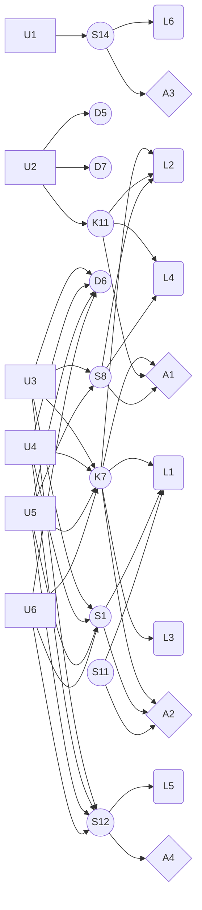

# Unit Specification

This diagram shows how the ***U***nits, ***A***ssessments and ***L***earning outcomes described in the unit specification Word document relate to the KSBs.

```mermaid
graph LR
        
    U1[U1]-->S14((S14))
    U2[U2]-->D5((D5))
    U2[U2]-->D7((D7))
    U2[U2]-->K11((K11))
    U3[U3]-->D6((D6))
    U3[U3]-->K7((K7))
    U3[U3]-->S12((S12))
    U3[U3]-->S1((S1))
    U3[U3]-->S8((S8))
    U4[U4]-->D6((D6))
    U4[U4]-->S1((S1))
    U4[U4]-->K7((K7))
    U4[U4]-->S12((S12))
    U5[U5]-->D6((D6))
    U5[U5]-->S1((S1))
    U5[U5]-->K7((K7))
    U5[U5]-->S12((S12))
    U5[U5]-->S8((S8))
    U6[U6]-->S1((S1))
    U6[U6]-->D6((D6))
    U6[U6]-->K7((K7))
    U6[U6]-->S12((S12))

    K7((K7))-->L1(L1)
    S1((S1))-->L1(L1)
    S11((S11))-->L1(L1)
    K7((K7))-->L2(L2)
    K11((K11))-->L2(L2)
    S8((S8))-->L2(L2)
    K7((K7))-->L3(L3)
    K11((K11))-->L4(L4)
    S8((S8))-->L4(L4)
    S12((S12))-->L5(L5)
    S14((S14))-->L6(L6)
    
    K7((K7))-->A1{A1}
    K11((K11))-->A1{A1}
    S8((S8))-->A1{A1}
    K7((K7))-->A2{A2}
    S1((S1))-->A2{A2}
    S11((S11))-->A2{A2}
    S14((S14))-->A3{A3}
    S12((S12))-->A4{A4}
```
